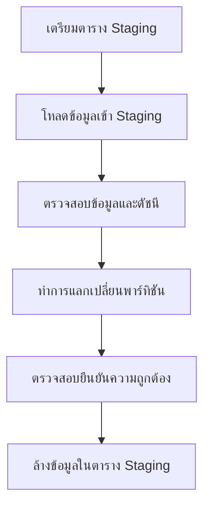
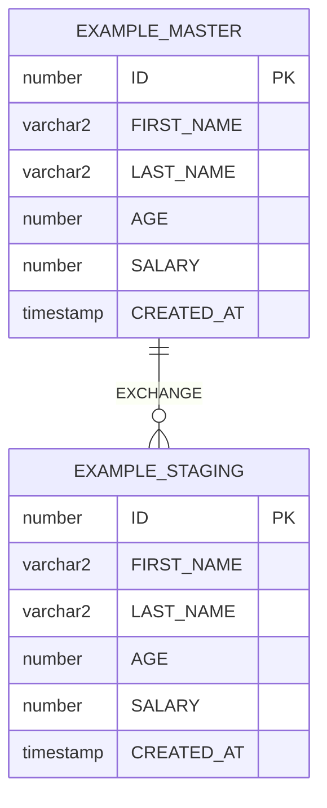

# การแลกเปลี่ยนพาร์ทิชันใน Oracle Database (Oracle Partition Exchange)

## 1. บทนำ

### ภาพรวมแนวคิดการแลกเปลี่ยนพาร์ทิชัน

การแลกเปลี่ยนพาร์ทิชัน (Partition Exchange) เป็นเทคนิคประสิทธิภาพสูงใน Oracle Database ที่ช่วยให้สามารถทำการสลับข้อมูลระหว่างตารางและพาร์ทิชันได้อย่างรวดเร็ว โดยไม่ต้องทำการโอนย้ายข้อมูลจริง แต่เป็นการสลับพอยน์เตอร์ (pointers) ที่ชี้ไปยังเซกเมนต์ข้อมูล ทำให้การทำงานเร็วกว่าการ INSERT หรือ MERGE แบบปกติมาก

### ประโยชน์และกรณีการใช้งาน

1. **การโหลดข้อมูลขนาดใหญ่แบบเร็ว**: เหมาะสำหรับระบบที่ต้องโหลดข้อมูลปริมาณมากเข้าสู่ตารางหลักอย่างรวดเร็ว
2. **การอัพเดทข้อมูลแบบแบตช์**: ใช้ในการอัพเดทข้อมูลชุดใหญ่ที่เกี่ยวข้องกับพาร์ทิชันเฉพาะ
3. **การจัดเก็บข้อมูลประวัติ**: สามารถแลกเปลี่ยนข้อมูลเก่าไปเก็บในตารางอื่นได้อย่างรวดเร็ว
4. **การลดเวลาหน้าต่างการบำรุงรักษา**: ลดเวลา downtime เนื่องจากการแลกเปลี่ยนทำได้เร็วกว่าการโอนย้ายข้อมูล
5. **การจัดการโครงสร้างข้อมูล**: สามารถปรับแต่งข้อมูลในตาราง staging ก่อนที่จะแลกเปลี่ยนเข้าตารางหลัก

### การทำงานในภาพรวม

กระบวนการแลกเปลี่ยนพาร์ทิชันประกอบด้วยขั้นตอนหลักๆ ดังนี้:



## 2. โครงสร้างตาราง

### ตารางหลัก (EXAMPLE_MASTER)

ตารางหลักเป็นตารางแบบแบ่งพาร์ทิชัน (partitioned table) ที่มีข้อมูลจริงของระบบ:

| คอลัมน์ | ชนิดข้อมูล | คำอธิบาย |
|---------|----------|----------|
| ID | NUMBER | รหัสหลัก (Primary Key) |
| FIRST_NAME | VARCHAR2(100) | ชื่อ |
| LAST_NAME | VARCHAR2(100) | นามสกุล |
| AGE | NUMBER | อายุ |
| SALARY | NUMBER | เงินเดือน |
| CREATED_AT | TIMESTAMP | วันเวลาที่สร้าง |

**การแบ่งพาร์ทิชัน**: ตารางหลักใช้การแบ่งพาร์ทิชันแบบ LIST บนฟิลด์ ID โดยมีพาร์ทิชัน DEFAULT ชื่อ PDATA

```sql
PARTITION BY LIST (ID) (
  PARTITION PDATA VALUES (DEFAULT)
)
```

### ตาราง Staging (EXAMPLE_STAGING)

ตาราง staging เป็นตารางปกติ (ไม่แบ่งพาร์ทิชัน) ที่มีโครงสร้างเหมือนกับตารางหลัก:

| คอลัมน์ | ชนิดข้อมูล | คำอธิบาย |
|---------|----------|----------|
| ID | NUMBER | รหัสหลัก (Primary Key) |
| FIRST_NAME | VARCHAR2(100) | ชื่อ |
| LAST_NAME | VARCHAR2(100) | นามสกุล |
| AGE | NUMBER | อายุ |
| SALARY | NUMBER | เงินเดือน |
| CREATED_AT | TIMESTAMP | วันเวลาที่สร้าง |

### แผนภาพโครงสร้างตารางและความสัมพันธ์



### ดัชนี (Indexes)

ทั้งสองตารางมีดัชนีที่เหมือนกันเพื่อให้แลกเปลี่ยนพาร์ทิชันได้:

**ดัชนีตารางหลัก (EXAMPLE_MASTER):**

| ชื่อดัชนี | คอลัมน์ | ประเภท | คำอธิบาย |
|---------|----------|----------|----------|
| SYS_xxx | ID | Primary Key | ดัชนี Primary Key (สร้างอัตโนมัติ) |
| EXAMPLE_MASTER_LN_IDX | LAST_NAME | Regular | ดัชนีสำหรับการค้นหาด้วยนามสกุล |
| EXAMPLE_MASTER_NAME_IDX | (FIRST_NAME, LAST_NAME) | Composite | ดัชนีสำหรับการค้นหาด้วยชื่อและนามสกุล |
| EXAMPLE_MASTER_SALARY_IDX | SALARY | Regular | ดัชนีสำหรับการค้นหาด้วยเงินเดือน |
| EXAMPLE_MASTER_AGE_IDX | AGE | Global | ดัชนีสำหรับการค้นหาด้วยอายุ (ต้องการ UPDATE GLOBAL INDEXES) |
| EXAMPLE_MASTER_CREATED_IDX | CREATED_AT | Regular | ดัชนีสำหรับการค้นหาด้วยวันเวลาที่สร้าง |

**ดัชนีตาราง Staging (EXAMPLE_STAGING):**

| ชื่อดัชนี | คอลัมน์ | ประเภท | คำอธิบาย |
|---------|----------|----------|----------|
| SYS_xxx | ID | Primary Key | ดัชนี Primary Key (สร้างอัตโนมัติ) |
| EXAMPLE_STAGING_LN_IDX | LAST_NAME | Regular | ดัชนีสำหรับการค้นหาด้วยนามสกุล |
| EXAMPLE_STAGING_NAME_IDX | (FIRST_NAME, LAST_NAME) | Composite | ดัชนีสำหรับการค้นหาด้วยชื่อและนามสกุล |
| EXAMPLE_STAGING_SALARY_IDX | SALARY | Regular | ดัชนีสำหรับการค้นหาด้วยเงินเดือน |
| EXAMPLE_STAGING_AGE_IDX | AGE | Regular | ดัชนีสำหรับการค้นหาด้วยอายุ |
| EXAMPLE_STAGING_CREATED_IDX | CREATED_AT | Regular | ดัชนีสำหรับการค้นหาด้วยวันเวลาที่สร้าง |

## 3. กระบวนการตั้งค่า (Setup Process)

### ขั้นตอนการเตรียมการ

1. **เตรียมสภาพแวดล้อม Oracle Database**
2. **รันสคริปต์ `partition_exchange_setup.sql`** เพื่อสร้างตารางและดัชนี

### การสร้างตารางหลักแบบแบ่งพาร์ทิชัน

```sql
CREATE TABLE EXAMPLE_MASTER (
  ID          NUMBER PRIMARY KEY,
  FIRST_NAME  VARCHAR2(100),
  LAST_NAME   VARCHAR2(100),
  AGE         NUMBER,
  SALARY      NUMBER,
  CREATED_AT  TIMESTAMP
)
-- ใช้ LIST partitioning กับพาร์ทิชัน DEFAULT ชื่อ PDATA
PARTITION BY LIST (ID) (
  PARTITION PDATA VALUES (DEFAULT)
);
```

### การสร้างดัชนีบนตารางหลัก

```sql
-- Primary Key สร้างดัชนีบน ID โดยอัตโนมัติ

-- ดัชนีบน LAST_NAME
CREATE INDEX EXAMPLE_MASTER_LN_IDX ON EXAMPLE_MASTER (LAST_NAME);

-- ดัชนีแบบ composite สำหรับการค้นหาด้วยชื่อ
CREATE INDEX EXAMPLE_MASTER_NAME_IDX ON EXAMPLE_MASTER (FIRST_NAME, LAST_NAME);

-- ดัชนีบน SALARY สำหรับการค้นหาแบบช่วง
CREATE INDEX EXAMPLE_MASTER_SALARY_IDX ON EXAMPLE_MASTER (SALARY);

-- ดัชนี Global บน AGE
CREATE INDEX EXAMPLE_MASTER_AGE_IDX ON EXAMPLE_MASTER (AGE);

-- ดัชนีบน CREATED_AT
CREATE INDEX EXAMPLE_MASTER_CREATED_IDX ON EXAMPLE_MASTER (CREATED_AT);
```

### การสร้างตาราง Staging

```sql
CREATE TABLE EXAMPLE_STAGING (
  ID          NUMBER PRIMARY KEY,
  FIRST_NAME  VARCHAR2(100),
  LAST_NAME   VARCHAR2(100),
  AGE         NUMBER,
  SALARY      NUMBER,
  CREATED_AT  TIMESTAMP
);
```

### การสร้างดัชนีบนตาราง Staging

```sql
-- Primary Key สร้างดัชนีบน ID โดยอัตโนมัติ

-- ดัชนีบน LAST_NAME
CREATE INDEX EXAMPLE_STAGING_LN_IDX ON EXAMPLE_STAGING (LAST_NAME);

-- ดัชนีแบบ composite
CREATE INDEX EXAMPLE_STAGING_NAME_IDX ON EXAMPLE_STAGING (FIRST_NAME, LAST_NAME);

-- ดัชนีบน SALARY
CREATE INDEX EXAMPLE_STAGING_SALARY_IDX ON EXAMPLE_STAGING (SALARY);

-- ดัชนีบน AGE
CREATE INDEX EXAMPLE_STAGING_AGE_IDX ON EXAMPLE_STAGING (AGE);

-- ดัชนีบน CREATED_AT
CREATE INDEX EXAMPLE_STAGING_CREATED_IDX ON EXAMPLE_STAGING (CREATED_AT);
```

## 4. กระบวนการแลกเปลี่ยนพาร์ทิชัน (Partition Exchange Process)

### การเตรียมตาราง Staging

ก่อนทำการแลกเปลี่ยนพาร์ทิชัน เราควรสร้างดัชนีที่ตาราง Staging ใหม่เพื่อป้องกันปัญหา ORA-01502:

```sql
-- สร้างดัชนีทั้งหมดบนตาราง Staging ใหม่
BEGIN
  FOR idx IN (SELECT index_name FROM user_indexes WHERE table_name = 'EXAMPLE_STAGING') LOOP
    EXECUTE IMMEDIATE 'ALTER INDEX ' || idx.index_name || ' REBUILD';
  END LOOP;
END;
```

### การโหลดข้อมูลเข้าตาราง Staging

```sql
-- แทรกข้อมูลตัวอย่างลงในตาราง Staging
INSERT INTO EXAMPLE_STAGING (ID, FIRST_NAME, LAST_NAME, AGE, SALARY, CREATED_AT)
VALUES (1, 'ALICE', 'ADAMS', 30, 90000, CURRENT_TIMESTAMP);

INSERT INTO EXAMPLE_STAGING (ID, FIRST_NAME, LAST_NAME, AGE, SALARY, CREATED_AT)
VALUES (2, 'BOB', 'BROWN', 28, 70000, CURRENT_TIMESTAMP);

COMMIT;
```

### การตรวจสอบก่อนการแลกเปลี่ยน

```sql
-- ตรวจสอบจำนวนแถวก่อนการแลกเปลี่ยน
SELECT COUNT(*) AS CNT FROM EXAMPLE_MASTER PARTITION (PDATA);
SELECT COUNT(*) AS CNT FROM EXAMPLE_STAGING;
```

### การทำการแลกเปลี่ยนพาร์ทิชัน

```sql
-- ทำการแลกเปลี่ยนพาร์ทิชัน
ALTER TABLE EXAMPLE_MASTER
    EXCHANGE PARTITION PDATA
    WITH TABLE EXAMPLE_STAGING
    WITHOUT VALIDATION;
  
-- เพิ่ม COMMIT หลังการแลกเปลี่ยนเพื่อให้แน่ใจว่าธุรกรรมเสร็จสมบูรณ์
COMMIT;
```

### การตรวจสอบหลังการแลกเปลี่ยน

```sql
-- ตรวจสอบจำนวนแถวหลังการแลกเปลี่ยน
SELECT COUNT(*) AS CNT FROM EXAMPLE_MASTER PARTITION (PDATA);
SELECT COUNT(*) AS CNT FROM EXAMPLE_STAGING;

-- แสดงข้อมูลพร้อมค่าวันเวลาเพื่อตรวจสอบการแลกเปลี่ยน
SELECT ID, FIRST_NAME, LAST_NAME, CREATED_AT 
FROM EXAMPLE_MASTER PARTITION (PDATA)
ORDER BY ID;
```

### การทำความสะอาดตาราง Staging (ตัวเลือก)

```sql
-- ล้างข้อมูลในตาราง Staging เพื่อเตรียมสำหรับการใช้งานครั้งต่อไป
TRUNCATE TABLE EXAMPLE_STAGING;
```

## 5. ตัวอย่างข้อมูลและผลลัพธ์

### ข้อมูลก่อนการแลกเปลี่ยน

**ตารางหลัก (EXAMPLE_MASTER) - พาร์ทิชัน PDATA:**
*ไม่มีข้อมูล (0 แถว)*

**ตาราง Staging (EXAMPLE_STAGING):**

| ID | FIRST_NAME | LAST_NAME | AGE | SALARY | CREATED_AT |
|----|------------|-----------|-----|--------|------------|
| 1 | ALICE | ADAMS | 30 | 90000 | 2025-10-02 01:45:00 |
| 2 | BOB | BROWN | 28 | 70000 | 2025-10-02 01:45:00 |

### ข้อมูลหลังการแลกเปลี่ยน

**ตารางหลัก (EXAMPLE_MASTER) - พาร์ทิชัน PDATA:**

| ID | FIRST_NAME | LAST_NAME | AGE | SALARY | CREATED_AT |
|----|------------|-----------|-----|--------|------------|
| 1 | ALICE | ADAMS | 30 | 90000 | 2025-10-02 01:45:00 |
| 2 | BOB | BROWN | 28 | 70000 | 2025-10-02 01:45:00 |

**ตาราง Staging (EXAMPLE_STAGING):**
*ไม่มีข้อมูล (0 แถว) เพราะข้อมูลได้ถูกย้ายไปยังตารางหลัก*

## 6. ปัญหาที่พบบ่อยและวิธีแก้ไข

### ข้อผิดพลาด ORA-01502

```
ORA-01502: index 'XXX' or partition of such index is in unusable state
```

**สาเหตุ:** ดัชนีอยู่ในสถานะที่ใช้งานไม่ได้ มักเกิดหลังจากการแลกเปลี่ยนพาร์ทิชันหรือการทำ DDL อื่นๆ

**วิธีแก้ไข:** สร้างดัชนีใหม่ก่อนที่จะใช้งานตาราง:

```sql
-- สร้างดัชนีทั้งหมดใหม่
BEGIN
  FOR idx IN (SELECT index_name FROM user_indexes WHERE table_name = 'EXAMPLE_STAGING') LOOP
    EXECUTE IMMEDIATE 'ALTER INDEX ' || idx.index_name || ' REBUILD';
  END LOOP;
END;
```

### ปัญหาเกี่ยวกับความเข้ากันได้กับ SQLcl

**สาเหตุ:** SQLcl มีปัญหาเกี่ยวกับการใช้ `UPDATE GLOBAL INDEXES` และ `INCLUDING INDEXES` ในคำสั่ง `EXCHANGE PARTITION`

**วิธีแก้ไข:** ใช้ไวยากรณ์ที่ง่ายขึ้น:

```sql
-- ใช้ไวยากรณ์อย่างง่ายสำหรับความเข้ากันได้กับ SQLcl
ALTER TABLE EXAMPLE_MASTER
    EXCHANGE PARTITION PDATA
    WITH TABLE EXAMPLE_STAGING
    WITHOUT VALIDATION;
```

### การจัดการดัชนี Global

**ปัญหา:** ดัชนี Global ต้องได้รับการปรับปรุงระหว่างการแลกเปลี่ยนพาร์ทิชัน

**วิธีแก้ไข:** ใช้ `UPDATE GLOBAL INDEXES` หรือสร้างดัชนีใหม่หลังการแลกเปลี่ยน:

```sql
-- ตัวเลือก 1: ใช้ UPDATE GLOBAL INDEXES (ช้ากว่าแต่ดัชนียังคงใช้งานได้)
ALTER TABLE EXAMPLE_MASTER
    EXCHANGE PARTITION PDATA
    WITH TABLE EXAMPLE_STAGING
    INCLUDING INDEXES
    UPDATE GLOBAL INDEXES
    WITHOUT VALIDATION;

-- ตัวเลือก 2: สร้างดัชนี Global ใหม่หลังการแลกเปลี่ยน (เร็วกว่า)
ALTER TABLE EXAMPLE_MASTER
    EXCHANGE PARTITION PDATA
    WITH TABLE EXAMPLE_STAGING
    WITHOUT VALIDATION;

ALTER INDEX EXAMPLE_MASTER_AGE_IDX REBUILD;
```

## 7. ข้อควรพิจารณาด้านประสิทธิภาพ

### เมื่อใดที่ควรใช้การแลกเปลี่ยนพาร์ทิชัน

1. **ข้อมูลปริมาณมาก:** เหมาะสำหรับการโหลดหรืออัพเดทข้อมูลจำนวนมาก
2. **การทำงานแบบแบตช์:** ใช้สำหรับการประมวลผลข้อมูลเป็นชุด
3. **หน้าต่างการบำรุงรักษาจำกัด:** ใช้เมื่อต้องการลดเวลา downtime

### ผลกระทบของดัชนีต่อประสิทธิภาพ

1. **ดัชนี Local:** มีผลกระทบน้อยต่อการแลกเปลี่ยนพาร์ทิชัน
2. **ดัชนี Global:** การใช้ `UPDATE GLOBAL INDEXES` จะช้ากว่า แต่ดัชนียังคงใช้งานได้หลังการแลกเปลี่ยน
3. **กลยุทธ์ทางเลือก:** ไม่ใช้ `UPDATE GLOBAL INDEXES` แต่สร้างดัชนี Global ใหม่หลังการแลกเปลี่ยน

### ตัวเลือกการตรวจสอบ (Validation)

1. **WITH VALIDATION:** Oracle จะตรวจสอบว่าข้อมูลเป็นไปตามเงื่อนไขพาร์ทิชัน (ช้ากว่า)
2. **WITHOUT VALIDATION:** ไม่มีการตรวจสอบข้อมูล (เร็วกว่า) แต่ข้อมูลที่ไม่ถูกต้องอาจทำให้เกิดปัญหา

### กลยุทธ์การประมวลผลแบบแบตช์

1. **การเตรียมข้อมูลล่วงหน้า:** จัดเตรียมและตรวจสอบข้อมูลในตาราง Staging ก่อน
2. **การสร้างดัชนีล่วงหน้า:** สร้างดัชนีในตาราง Staging ก่อนการแลกเปลี่ยน
3. **การทำงานขนาน:** ใช้ `PARALLEL` ในการสร้างดัชนีและโหลดข้อมูล

## 8. แหล่งข้อมูลเพิ่มเติม

- [Oracle Documentation: Partition Exchange](https://docs.oracle.com/en/database/oracle/oracle-database/19/vldbg/partition-exchange-operations.html)
- [Oracle Documentation: Global Index Maintenance](https://docs.oracle.com/en/database/oracle/oracle-database/19/vldbg/maintain-global-indexes.html)
- [Oracle Error ORA-01502](https://docs.oracle.com/error-help/db/ora-01502/)